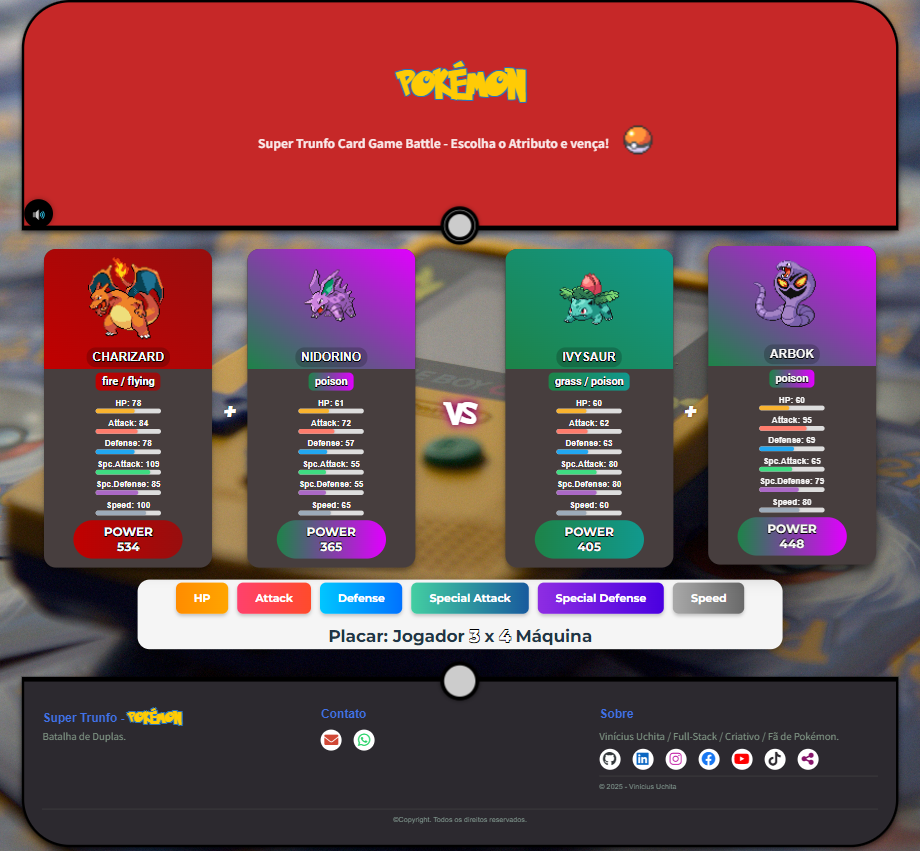

# 🎮⚡ Super Trunfo Pokémon 💥❄️

## 🖼️ Captura de Tela

</br>

## 📊 Descrição

Bem-vindo ao **Super Trunfo Pokémon!** 🔥  
Um jogo de cartas épico, inspirado no clássico jogo de cartas **Super Trunfo™**. Agora com batalhas emocionantes entre Pokémon®, impulsionado pela **API Oficial Pokémon™** - [**PokéAPI™**](https://pokeapi.co/).

Desenvolvido com [**React**](https://react.dev/) + [**Vite**](https://vite.dev/) para uma experiência ultra rápida, interativa e cheia de estilo.

**Prepare-se para duelos lendários!** 🐉

---

## 🕹️ Jogue Agora!

**💥 Super Trunfo Pokémon Online**

Você pode acessar o projeto online diretamente pelo seu navegador ou smartphone através do link abaixo:

**[🔗 Link fictício — personalize com o seu deploy!](https://seu-link-aqui.com)**

Entre na arena, escolha seu Pokémon e **domine as batalhas**!

---

## 📋 Funcionalidades

### 🔀 Sorteio Épico:

1. **Distribuição das Cartas**:

   - São sorteadas 4 cartas: 2 para o **Jogador** e 2 para a **Máquina**.
   - Cada carta representa um Pokémon diferente com 6 atributos:
     </br>**HP**, **Ataque** , **Defesa** , **Especial Ataque**, **Especial Defesa** e **Velocidade**.

2. **Escolha do Atributo**:

   - O jogador escolhe um dos três atributos para comparar (**HP**, **Ataque** , **Defesa** , **Especial Ataque**, **Especial Defesa** ou **Velocidade**).
   - O valor do atributo escolhido é **somado nas duas cartas** do Jogador e nas duas cartas da Máquina.

3. **Comparação**:

   - A dupla com a maior soma no atributo escolhido vence a rodada.
   - Em caso de empate, a rodada é considerada nula.

4. **Combinações**:
   - O jogo possui os **151 Pokémons Clássicos** + **6 Pokémons Surpresa** e com uma excelente lógica de sorteio, o mesmo Pokémon naõ será repetido na mesma jogada, permitindo ao usúario **milhares de combinações diferentes**. Cada jogo será uma nova experiência! 🌟

### 🎨 Visual Incrível e NOVIDADES EXCLUSIVAS:

- Cartas estilizadas com **nome, imagem oficial, tipo e atributos**.
- Os Pokémons tem seus **cards estilizados** de acordo com seu **tipo** e Pokémons com habilidades especiais tem seus cards com efeitos visuais únicos!
- O vencedor é destacado com **animações vibrantes**!
- Sistema de **som** com **efeitos sonoros nostálgicos**!
- E a novidade especial é que preparei **3 EASTER EGGS SECRETOS!**

---

## 🚀 Tecnologias de Ponta

- ⚛️ **React + Vite**: Interface moderna e desempenho otimizado.
- 🟨 **JavaScript (ES6+)**: Lógica dinâmica e robusta.
- 🌐 **PokéAPI**: Dados em tempo real de mais de 1000 Pokémon.
- 📡 **Axios**: Requisições HTTP rápidas e confiáveis.
- 🎨 **HTML + CSS Modular**: Estilização responsiva com tema Pokémon.
- 🛠️ **Git & GitHub**: Controle de versão e colaboração.
- 🧩 **Código Modular**: Estrutura escalável com **React Hooks** e componentes reutilizáveis.

---

## 🛠️ Como Rodar Localmente

Quer testar o jogo no seu PC? Siga esses passos simples:

1. **Clone o repositório**:

```bash
[clique aqui para acessar o repositório](https://github.com/devviniuchita/oracle_next-education_one_alura.git)
```

2. **Entre na pasta**:

```bash
cd super-trunfo-pokemon
```

3. **Abra o diretório**:

```bash
npm install
```

4. **Inicie o servidor de desenvolvimento**

```bash
npm run dev
```

---

## 📌 Acesse

Abra [http://localhost:5173](http://localhost:5173) no seu navegador e comece a batalha!

---

## 📈 Status do Projeto

### ✅ Concluído:

- Estrutura modular com React + Vite.
- Lógica de comparação via PokéAPI.
- Interface responsiva e estilizada.

### 🔄 Em Desenvolvimento e Projetos para o futuro:

- 🔴⚪⚫ **Novos Pokémons adicionados**.
- 👥 Modo multiplayer online.
- 📊 Sistema de placar e ranking.
- 🎥 Melhoria de animações e transições.
- 🗄️ Integração com banco de dados e API própria.

---

## 🤝 Como Contribuir

**Contribuições são bem-vindas!** Se você quiser melhorar o jogo, siga os passos abaixo para contribuir:

```bash
# Faça um fork do repositório

# Crie uma branch para sua feature
git checkout -b minha-feature

# Commit suas alterações
git commit -m "feat: minha feature"

# Envie para o repositório
git push origin minha-feature

Abra um **Pull Request** e vamos construir juntos!
```

---

## 📄 Licença

Este projeto está sob a **Licença MIT**.
Veja mais detalhes no arquivo [`LICENSE`](LICENSE).</br>
Todos os direitos reservados.

---

## 🙌 Agradecimentos

- 🖤 À comunidade **open-source** por todo o suporte.
- 🌟 À **PokéAPI™** por fornecer dados incríveis.
- 🎲 Ao clássico **Super Trunfo™** por inspirar gerações.
- 🖼️ À **Pokémon®/Nintendo®** pelas imagens oficiais.</br></br>

## 🌐 Créditos às imagens e ícones utilizados

- [Unsplash](https://unsplash.com/pt-br)
- [CDNJS](https://cdnjs.cloudflare.com)
- [UNPKG](https://unpkg.com)
- [GitHub Raw](https://raw.githubusercontent.com)

---

## 💬 Vamos Conversar?

Quer sugerir melhorias, relatar bugs ou apenas compartilhar sua paixão por Pokémon?
**📧 Contato**: viniciusuchita@gmail.com </br>ou abra uma **[Issue no GitHub ](https://github.com/devviniuchita)** e junte-se à comunidade!

---

## Feito com ❤️ por **_Dev Vinícius Uchita_**.

> **Que venha a próxima batalha!** 🐾✨
> S

```

```
